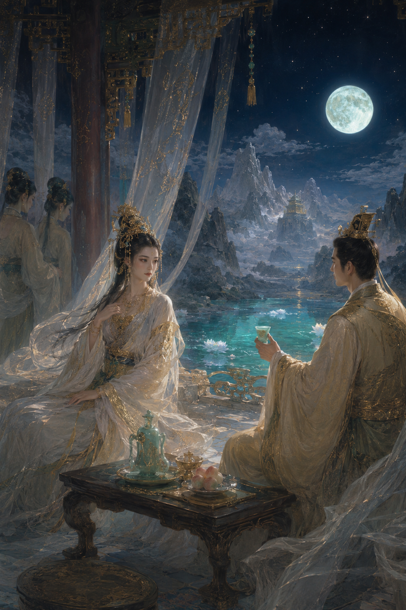

  <h1>《穆天子會西王母記》</h1>

  

## 體裁

駢文

## 題材

穆天子西巡、西王母瑤池相會、宴飲贈答、臨別相思

## 創作意圖

取《穆天子傳》與西王母會見故事爲本，寫其西巡之奇、瑤池之豔、對坐之歡、將別之思。筆法以駢儷爲骨，以神話香霧爲色，以情意低徊爲韻；務求華美而不浮豔，親近而不流俗，有首有尾，可觀可誦。

## 正文

### v2

昔穆王御八駿（周穆王所乘名馬，古稱八駿），戒六師而西巡；辭宗周於曉色，指流沙於暮雲。於是玉轡搖霞，金根（天子之車）動日；旌旆拂漢，鐃吹薄旻。度弱水而天低，望崦嵫（古代傳說中日入之山）而景昏。山川詭譎，草木異芬；或丹巖耀采，或翠壁生紋。旣而玄圃（崑崙仙境）在望，瑤池可臨，天子乃息駕清渚，駐蹕層岑。

時則西王母方居金闕，暫啓珠扃（珠飾之門）；聞王旌而命侍，拂雲袖而延賓。於是青鳥前導（西王母使者），素女徐陳；蘭煙縈砌，桂霧侵茵。瑤臺對敞，璿室相因（璿室，華美之室）；流光蕩戶，馥氣浮巾。天子既升，望若神仙中人：但見鬢挽朝霞，眉含遠岫；佩搖瓊響，衣轉輕塵。其容也，非人間之豔可以方；其姿也，似秋水之波未易親。

於是王母斂袂而笑，延坐而前。命設蒲桃（葡萄）之醑，兼陳麟脯之筵；瓊漿映琖，玉膾登盤。朱桃半破，碧李初鮮。金爐細細，暖篆微旋；錦屏半掩，繡幕低懸。穆王顧而神奪，欲言還止；王母視而意存，未語先憐。於是酒行三爵，春入兩顔；雖隔雲階之肅肅，已通目色之綿綿。

若其酣然興會，漸至夜闌，則月上瑤岑，露下瓊壇。侍女卷幔，流輝滿欄。王母乃親拈鳳管，低按鸞絃；曲未終而聲已咽，情將動而態仍閒。穆王於是側席而聽，斂容以觀；但覺香風暗度，疑有蘭心在懷；綺語欲成，偏被玉笑相攔。彼時也，並坐非遽相逼，對酌自成幽歡。只一回眸，已足驚鴻之態；偶然近語，便生綢繆之端。

旣而更漏漸深，銀燭半灺（燭將盡）；香暖羅幃，影移珠瓦。天子酒意微醺，情懷已假；欲伸久慕之誠，恐犯仙居之雅。王母知其心，乃不卽退；但命侍者徐卻，珠簾半下，翠鬟近侍，緩移蓮步。時而舉袂障燈，時而低眉避顧；似許還疑，將迎若拒。穆王因前一席，衣上龍紋微動；王母纔側其肩，鬢邊鳳鈿輕搖。兩影漸親於燈底，一香暗滿於襟前。玉腕纔伸，止爲添酌（添酒）；纖指微停，若將整珮（整理佩飾）。酒意未消，春心已軟；語聲愈細，呼吸相憐。穆王但覺羅袖拂几，如雲度月；芳澤近人，似雨蒸煙。欲更近而恐驚清範，欲卽止而難禁綺念。王母則眸光欲流還斂，脣意欲啓仍緘；臨風坐久，雪肌微暖，對月言遲，玉頰生妍。於是歡不在狎，而在將近未近；情不在宣，而在欲前還前。雲鬟低亞，幾拂王冠；綵佩徐迴，若縈御袂。香氣愈濃，夜色愈嫵；一殿春生，滿池月吐。使人知巫山之夢雖艷，未若瑤池之會更妍；宋玉之辭雖工，不盡此夕之婉孌（情態柔美纏綿）。

少焉東方欲曙，河漢將傾；宿鳥初語，曉露先零。王母乃命收殘席，重整雲軿（華美車駕）；顔光雖定，眸意猶凝。穆王知仙凡路隔，良會難仍，因再拜而陳曰：萬里西來，本求異境；一朝親覿，更動凡情。願託鴻音於青鳥，庶寄遐思於瑤京。王母聞之，不卽答語，唯微歎而起，臨風而行。既而回身顧王，乃歌曰：白雲在天，丘陵自出；道里悠遠，山川間之。將子無死，尚復能來。

歌罷，四座爲寂；風滿瑤林，露寒珠箔。穆王聞而心折，欲留無策；但覺歌中有情，情中有隔。於是執玉觴而不飲，望丹霄而如失。王母亦不復多言，止命青鳥送客，彩鸞迴蹕。及天子下瑤階、出瓊關，回望則煙開碧落，日上西山；仙宮縹緲，已在雲間。唯餘衣上微香，袖中餘暖，似昨夜之笑語未闌，而今朝之車塵已遠。

然則此會也，非徒誇四海之遊，亦足寫千秋之思。穆王以人主之尊，至此而知有不可留之豔；王母居仙靈之貴，對之而生不盡言之情。故其妙不在衾枕之私，而在對坐之間；不在形骸之接，而在顧盼之際。使後之覽者，但覺瑤池月冷，青鳥信遲，雲旌去而餘香在，玉席空而舊夢移。若問此情何似，則惟西巡一夕，足誤英雄；王母一歌，遂成萬古相思。

## 修訂記錄

### v1

昔穆王御八駿（周穆王所乘名馬，古稱八駿），戒六師而西巡；辭宗周於曉色，指流沙於暮雲。於是玉轡搖霞，金根（天子之車）動日；旌旆拂漢，鐃吹薄旻。度弱水而天低，望崦嵫（古代傳說中日入之山）而景昏。山川詭譎，草木異芬；或丹巖耀采，或翠壁生紋。旣而玄圃（崑崙仙境）在望，瑤池可臨，天子乃息駕清渚，駐蹕層岑。

時則西王母方居金闕，暫啓珠扃（珠飾之門）；聞王旌而命侍，拂雲袖而延賓。於是青鳥前導（西王母使者），素女徐陳；蘭煙縈砌，桂霧侵茵。瑤臺對敞，璿室相因（璿室，華美之室）；流光蕩戶，馥氣浮巾。天子既升，望若神仙中人：但見鬢挽朝霞，眉含遠岫；佩搖瓊響，衣轉輕塵。其容也，非人間之豔可以方；其姿也，似秋水之波未易親。

於是王母斂袂而笑，延坐而前。命設蒲桃（葡萄）之醑，兼陳麟脯之筵；瓊漿映琖，玉膾登盤。朱桃半破，碧李初鮮。金爐細細，暖篆微旋；錦屏半掩，繡幕低懸。穆王顧而神奪，欲言還止；王母視而意存，未語先憐。於是酒行三爵，春入兩顔；雖隔雲階之肅肅，已通目色之綿綿。

若其酣然興會，漸至夜闌，則月上瑤岑，露下瓊壇。侍女卷幔，流輝滿欄。王母乃親拈鳳管，低按鸞絃；曲未終而聲已咽，情將動而態仍閒。穆王於是側席而聽，斂容以觀；但覺香風暗度，疑有蘭心在懷；綺語欲成，偏被玉笑相攔。彼時也，並坐非遽相逼，對酌自成幽歡。只一回眸，已足驚鴻之態；偶然近語，便生綢繆之端。

旣而更漏漸深，銀燭半灺（燭將盡）；香暖羅幃，影移珠瓦。天子酒意微醺，情懷已假；欲伸久慕之誠，恐犯仙居之雅。王母知其心，乃不卽退；但使翠鬟近侍，緩移蓮步。時而舉袂障燈，時而低眉避顧；似許還疑，將迎若拒。是以歡不在狎，而在神交；情不在宣，而在微度。雲鬟相映，止若並肩；玉手偶抬，不過勸酤（勸酒）。然而芳氣愈濃，夜色愈嫵；一殿春生，滿池月吐。使人知巫山之夢雖艷，未若瑤池之會更妍；宋玉之辭雖工，不盡此夕之婉孌（情態柔美纏綿）。

少焉東方欲曙，河漢將傾；宿鳥初語，曉露先零。王母乃命收殘席，重整雲軿（華美車駕）；顔光雖定，眸意猶凝。穆王知仙凡路隔，良會難仍，因再拜而陳曰：萬里西來，本求異境；一朝親覿，更動凡情。願託鴻音於青鳥，庶寄遐思於瑤京。王母聞之，不卽答語，唯微歎而起，臨風而行。既而回身顧王，乃歌曰：白雲在天，丘陵自出；道里悠遠，山川間之。將子無死，尚復能來。

歌罷，四座爲寂；風滿瑤林，露寒珠箔。穆王聞而心折，欲留無策；但覺歌中有情，情中有隔。於是執玉觴而不飲，望丹霄而如失。王母亦不復多言，止命青鳥送客，彩鸞迴蹕。及天子下瑤階、出瓊關，回望則煙開碧落，日上西山；仙宮縹緲，已在雲間。唯餘衣上微香，袖中餘暖，似昨夜之笑語未闌，而今朝之車塵已遠。

然則此會也，非徒誇四海之遊，亦足寫千秋之思。穆王以人主之尊，至此而知有不可留之豔；王母居仙靈之貴，對之而生不盡言之情。故其妙不在衾枕之私，而在對坐之間；不在形骸之接，而在顧盼之際。使後之覽者，但覺瑤池月冷，青鳥信遲，雲旌去而餘香在，玉席空而舊夢移。若問此情何似，則惟西巡一夕，足誤英雄；王母一歌，遂成萬古相思。

### v1 -> v2 主要改動

- 主要加強了宴後夜深一段，把原本偏概述的曖昧氣氛，改成更有畫面的近坐、添酌、障燈、回眸、香氣、呼吸與衣袖流動。
- 強化了“將近未近”的拉扯感，讓雲雨意味更多落在情勢、停頓和身體距離的變化上，而不是空泛說情。
- 保持含蓄分寸，不直寫粗白狎暱場面，仍以神女氣、仙居氣與駢文的華美感爲主。
